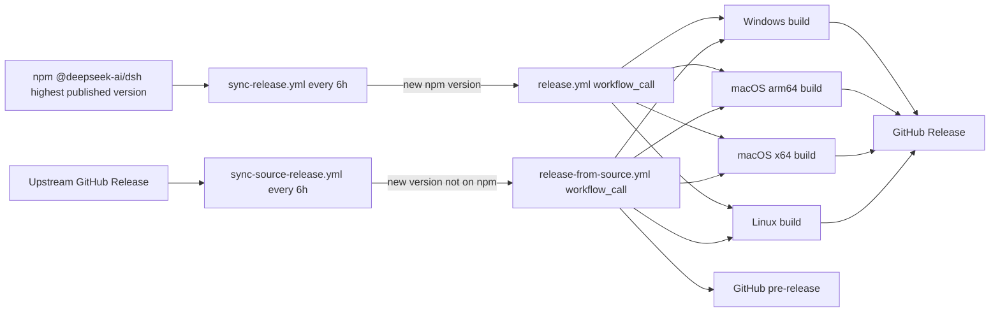

<p align="center">
  <a href="https://github.com/hairyf/deepseek-harness-pkg">
    
  </a>
</p>

<h1 align="center">DeepSeek Harness Pkg</h1>

<p align="center">
  <em>Prebuilt, cross-platform packages for <a href="https://github.com/deepseek-ai/deepseek-harness">DeepSeek Harness</a> (<code>dsh</code>) — pinned, patched, and auto-synced from upstream, built by GitHub Actions.</em>
</p>

<p align="center">
  <strong>English</strong> · <a href="./README.zh.md">中文</a>
</p>

<p align="center">
  
  
  
  
  
</p>
> **Status: developer preview.** The upstream `dsh` is still iterating rapidly with compatibility-breaking changes; this repository tracks it closely and rebuilds automatically.

## What Is This?

[DeepSeek Harness](https://github.com/deepseek-ai/deepseek-harness) (`dsh`) is an open-source agent harness with a CLI, a web UI, and a plugin architecture. Setting it up normally means installing Node.js and pnpm and building from source.

This repository (inspired by [n8n-pkg](https://github.com/hairyf/n8n-pkg)) removes that friction: it pins an upstream npm release, patches the dependency closure, and publishes ready-to-run `node_modules` bundles for Windows, macOS (Apple Silicon + Intel), and Linux. Consumers just download a zip from the [Releases](https://github.com/hairyf/deepseek-harness-pkg/releases) page, unzip, and run `dsh web`.

## Features

| | |
| --- | --- |
| **Pinned & reproducible** | A pnpm workspace pins a single upstream version (`@deepseek-ai/dsh`), with patches recorded in `patches/` and a committed lockfile. |
| **Patched dependency closure** | `patchedDependencies` patches packages inside the dependency closure, including a LAN-access switch for `dsh web`. |
| **Cross-platform artifacts** | CI builds bundles for Windows, macOS (arm64 + x64), and Linux and publishes them as GitHub Releases. |
| **Auto-sync with upstream** | A scheduled workflow watches npm for new `dsh` versions and triggers a rebuild automatically. |
| **Self-contained output** | Each artifact is a plain npm project — unzip, run the `dsh` binary inside `node_modules`, done. |

## Quick Start

1. Download the artifact for your platform from the [Releases](https://github.com/hairyf/deepseek-harness-pkg/releases) page.
2. Unzip the archive.
3. Run:

```sh
# Windows
node_modules\.bin\dsh.cmd web

# macOS / Linux
./node_modules/.bin/dsh web
```

The web UI opens at `http://127.0.0.1:3080`. On first use, configure a model provider (API key) in the UI — see the [official DeepSeek Harness docs](https://github.com/deepseek-ai/deepseek-harness).

> Requirements: Node.js `^22.19.0` or `>=24.0.0`. The artifact is a plain npm project, so no global pnpm installation is needed.

## Repository Structure

```text
.
├── .github/workflows/
│   ├── release.yml                 # npm-based cross-platform build + release
│   ├── release-from-source.yml     # source build + pre-release for GitHub-only versions
│   ├── sync-release.yml            # scheduled npm check that auto-triggers builds
│   └── sync-source-release.yml     # scheduled GitHub Release check for source builds
├── scripts/
│   └── apply-dsh-web-app-patch.mjs # idempotent patch script (re-applies the LAN switch on version bumps)
├── patches/                        # pnpm patches (patchedDependencies, version-pinned & reproducible)
├── pnpm-workspace.yaml             # nodeLinker / build policy / patchedDependencies (pnpm 11 settings)
├── package.json                    # pinned @deepseek-ai/dsh version
└── pnpm-lock.yaml                  # lockfile
```

## Local Build

Requirements: Node.js `>=22.19` (recommended 24), pnpm `11.x` (the repo declares `packageManager: pnpm@11.7.0`).

```sh
pnpm install            # install dependencies and apply patches
pnpm start              # run dsh web directly (http://127.0.0.1:3080)
pnpm build              # produce the prod deployment directory build_dir/
```

## Release

### Build all platforms from the private customized repository

Add an Actions secret named `HARNESS_SOURCE_TOKEN` under Settings → Secrets and variables → Actions. Use a fine-grained personal access token with Contents: Read access limited to `userAmani/deepseek-harness`.

Run **Build private Harness runtimes** manually and provide the Harness repository, branch/tag/commit, runtime SemVer, and minimum desktop version. A full commit SHA is recommended for reproducible releases.

The workflow builds the same Harness commit on Windows x64, macOS arm64, macOS x64, and Linux x64. Download the resulting `harness-server-upload-*` artifact and upload its contents unchanged under the website `/harness/` path. The workflow stores no OSS credentials and performs no server upload.

Local integration does not require committing Harness first. When the three repositories share one parent directory, run this repository with:

```sh
pnpm run build:private-harness -- \
  --harness ../deepseek-harness \
  --output dist/private-runtime \
  --version 0.1.2-enterprise.1 \
  --node-version 22.22.0
```

This builds only the current platform. Use **Build private Harness runtimes** for the official four-platform payload.

The final manifest URL must be:

```text
https://web.shuiwujia.com/harness/channels/stable/latest.json
```

Upload `releases/` first and replace `channels/stable/latest.json` last.

### Legacy upstream release (not used by the enterprise flow)

Open the repository's Actions page and manually trigger **Build and Release DeepSeek Harness**:

- `dsh_version`: the dsh version to package, defaults to `0.1.0-rc.6` (must match the version targeted by `patches/`, otherwise the build fails on a patch mismatch).

The build creates a GitHub Release named `dsh-<version>-<run_id>` with four platform zips:

| Platform | Artifact |
| --- | --- |
| Windows | `deepseek-harness-pkg-windows.zip` |
| macOS (Apple Silicon) | `deepseek-harness-pkg-macos-arm64.zip` |
| macOS (Intel) | `deepseek-harness-pkg-macos-x64.zip` |
| Linux | `deepseek-harness-pkg-linux.zip` |

## Patches

### dsh-web-app: LAN access (default off)

Upstream `dsh web` rejects `--host 0.0.0.0` for security reasons (it would expose the remote-code-execution surface to the network). The `patches/dsh-web-app@0.1.0-rc.6.patch` patch turns this into an **explicit environment-variable switch**:

```sh
# still rejected by default
dsh web --host 0.0.0.0            # error

# allow explicitly after acknowledging the risk (dangerous: exposes local RCE to the network)
DSH_PKG_ALLOW_LAN=1 dsh web --host 0.0.0.0 --trusted-host <LAN-IP>:3080
```

> ⚠️ Security warning: `--host 0.0.0.0` lets any device on your LAN access your sessions and tool execution. Use it only in trusted networks and pair it with `--trusted-host` to restrict the `/api` trust domain.

### Adding or updating patches

```sh
pnpm patch @deepseek-ai/dsh-web-app   # edit, then pnpm patch-commit to produce a .patch
```

Then register the new entry under `patchedDependencies` in `pnpm-workspace.yaml` (the version must match what the lockfile resolves). When upgrading dsh, `patches/` must be updated accordingly.

## Auto-sync Upstream Releases

The repository has two complementary scheduled workflows:

- **npm path — `sync-release.yml`**: checks every 6 hours and can also be triggered manually. It resolves the **semver-highest published version** through `scripts/resolve-latest-dsh-version.mjs`, covering all npm dist-tags (`latest`, `next`, …), then calls `release.yml`. After a successful npm release it updates `main` and the lockfile.
- **GitHub-only path — `sync-source-release.yml`**: checks every 6 hours whether the semver-highest upstream GitHub Release is newer than npm `@deepseek-ai/dsh`. If npm has not published that version yet, it calls `release-from-source.yml`, which clones the exact `dsh-v<version>` tag, runs `pnpm install` and `pnpm run build`, deploys the built workspace closure, and publishes four platform archives as a GitHub **pre-release**. These source pre-releases do not update `main`, because the version is not installable from npm yet.
- **Idempotency**: source releases use `dsh-src-<version>-<run_id>` tags. The source watcher skips a version already released this way, while the npm watcher ignores pre-releases so the two paths do not trigger each other repeatedly.
- **Patch tolerance**: `scripts/apply-dsh-web-app-patch.mjs` idempotently re-applies the LAN switch to the shipped `dsh-web-app`; if upstream changes the relevant guard, it fails loudly with a message to update the script.

For a manual source build, trigger **Build and Pre-release DeepSeek Harness from Source** and provide the upstream release version, without the `dsh-v` prefix (for example `0.1.2-alpha.1`).

Workflow reference:



## Security Notes

- This project is for personal learning, research, and testing only — please do not use it commercially.
- `dsh` is an agent harness with **local code execution capability**. Run it only in a trusted, isolated environment, and never import untrusted configurations or plugins from unknown sources.
- The LAN-access patch (`DSH_PKG_ALLOW_LAN=1`) is dangerous by design — only enable it on trusted networks.
- The developers are not liable for any data loss or security issues arising from the use of this project.

## Related Projects

| Project | Purpose |
| --- | --- |
| [deepseek-harness](https://github.com/deepseek-ai/deepseek-harness) | The upstream `dsh` (CLI + web UI + plugin architecture) |
| [deepseek-harness-desktop](https://github.com/hairyf/deepseek-harness-desktop) | One-click desktop app that consumes these prebuilt bundles |
| [n8n-pkg](https://github.com/hairyf/n8n-pkg) | Reference packaging repository this project is based on |

## Acknowledgements

- [DeepSeek Harness](https://github.com/deepseek-ai/deepseek-harness) — the upstream project
- [n8n-pkg](https://github.com/hairyf/n8n-pkg) — the packaging pattern
- [pnpm](https://pnpm.io/) — workspace, patching, and deploy tooling
- [GitHub Actions](https://github.com/features/actions) — cross-platform CI builds and releases
