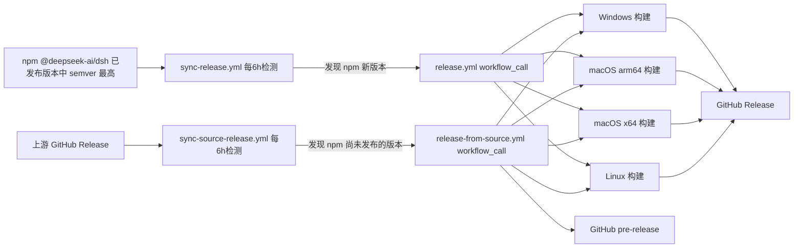

<p align="center">
  <a href="https://github.com/hairyf/deepseek-harness-pkg">
    
  </a>
</p>

<h1 align="center">DeepSeek Harness Pkg</h1>

<p align="center">
  <em><a href="https://github.com/deepseek-ai/deepseek-harness">DeepSeek Harness</a>（<code>dsh</code>）的跨平台预构建分发仓库 —— 固定上游版本、打补丁、由 GitHub Actions 自动同步构建。</em>
</p>

<p align="center">
  <a href="./README.md">English</a> · <strong>中文</strong>
</p>

<p align="center">
  
  
  
  
</p>

> **状态：开发者预览。** 上游 `dsh` 仍在快速迭代，常有破坏性变更；本仓库紧密跟进并自动重建。

## 这是什么？

[DeepSeek Harness](https://github.com/deepseek-ai/deepseek-harness)（`dsh`）是开源的 Agent 工作台，包含 CLI、Web UI 与插件架构。常规安装需要自己装 Node.js、pnpm 并从头构建。

本仓库（参考 [n8n-pkg](https://github.com/hairyf/n8n-pkg)）省掉这些麻烦：固定一个上游 npm 版本、对依赖闭包打补丁，并通过 GitHub Actions 产出 Windows、macOS（Apple Silicon + Intel）、Linux 三个平台可直接运行的 `node_modules` 压缩包。使用者只需从 [Releases](https://github.com/hairyf/deepseek-harness-pkg/releases) 下载对应平台的 zip，解压后运行 `dsh web` 即可。

## 特性

| | |
| --- | --- |
| **固定版本、可复现** | pnpm 工作区固定单个上游版本（`@deepseek-ai/dsh`），补丁记录在 `patches/`，锁文件一并提交。 |
| **补丁依赖闭包** | 通过 `patchedDependencies` 对依赖闭包内的包打补丁，包括 `dsh web` 的局域网访问开关。 |
| **跨平台产物** | CI 为 Windows、macOS（arm64 + x64）、Linux 构建压缩包并发布为 GitHub Release。 |
| **自动同步上游** | 定时工作流监听 npm 上新的 `dsh` 版本，发现后自动触发重新构建。 |
| **开箱即用** | 每个产物都是纯 npm 项目 —— 解压后直接运行 `node_modules` 里的 `dsh` 命令即可。 |

## 快速开始

1. 从 [Releases](https://github.com/hairyf/deepseek-harness-pkg/releases) 页面下载对应平台的产物。
2. 解压。
3. 运行：

```sh
# Windows
node_modules\.bin\dsh.cmd web

# macOS / Linux
./node_modules/.bin/dsh web
```

Web UI 会打开在 `http://127.0.0.1:3080`。首次使用需要在界面里配置模型提供方（API Key），详见 [DeepSeek Harness 官方文档](https://github.com/deepseek-ai/deepseek-harness)。

> 要求：Node.js `^22.19.0` 或 `>=24.0.0`。产物是纯 npm 项目，无需全局安装 pnpm。

## 目录结构

```text
.
├── .github/workflows/
│   ├── release.yml                 # 基于 npm 的跨平台构建 + 发布
│   ├── release-from-source.yml     # GitHub-only 版本的源码构建 + pre-release
│   ├── sync-release.yml             # 定时检测 npm 版本并自动构建
│   └── sync-source-release.yml      # 定时检测 GitHub Release 并触发源码构建
├── scripts/
│   └── apply-dsh-web-app-patch.mjs # 幂等补丁脚本（换版本也能自动打上 LAN 开关补丁）
├── patches/                        # pnpm 补丁（patchedDependencies，固定版本可复现）
├── pnpm-workspace.yaml             # nodeLinker/构建脚本策略/patchedDependencies 等（pnpm 11 设置统一在此）
├── package.json                    # 固定 @deepseek-ai/dsh 版本
└── pnpm-lock.yaml                  # 锁文件
```

## 本地构建

要求：Node.js `>=22.19`（推荐 24）、pnpm `11.x`（仓库已声明 `packageManager: pnpm@11.7.0`）。

```sh
pnpm install            # 安装依赖并应用补丁
pnpm start              # 本地直接运行：dsh web（http://127.0.0.1:3080）
pnpm build              # 产出 prod 部署目录 build_dir/
```

## 发布

### 从私有二开仓库构建四个平台

在仓库 Settings → Secrets and variables → Actions 中添加 `HARNESS_SOURCE_TOKEN`。该 Token 只需对 `userAmani/deepseek-harness` 具有 Contents: Read 权限；建议使用 fine-grained personal access token，并仅授权这一个源码仓库。

打开 Actions，手动运行 **Build private Harness runtimes**，填写：

- `harness_repository`：默认 `userAmani/deepseek-harness`。
- `harness_ref`：要打包的分支、tag 或完整 commit SHA；正式包建议填写 commit SHA。
- `runtime_version`：例如 `0.1.2-enterprise.1`。
- `minimum_desktop_version`：默认 `0.6.8`。

工作流会在 Windows x64、macOS arm64、macOS x64 和 Linux x64 上构建同一个 Harness 提交，最后产生 `harness-server-upload-*` Artifact。下载并解压后，将其中内容原样上传到网站 `/harness/` 目录。项目不保存 OSS 凭据，也不会自动上传服务器。

运行包固定内置 `dsh-tauri@0.6.7`，构建时校验 npm tarball 的 SHA-512。桌面端会直接从运行包加载该基础消息桥，首次启动不再为它访问 npm 或 GitHub；其他社区插件仍由用户按需安装。

本地联调不要求先提交 Harness。三个仓库位于同一父目录时，可在本仓库运行：

```sh
pnpm run build:private-harness -- \
  --harness ../deepseek-harness \
  --output dist/private-runtime \
  --version 0.1.2-enterprise.1 \
  --node-version 22.22.0
```

此命令只构建当前平台；正式四平台包仍由 **Build private Harness runtimes** 完成。

最终必须能访问：

```text
https://toutiao.cdn.shuiwujia.com/harness/channels/stable/latest.json
```

每次更新 Harness 时使用新的 `runtime_version` 和 `build-id` 路径；先上传 `releases/`，最后覆盖 `channels/stable/latest.json`。

### 上游兼容发布（企业流程不使用）

进入仓库的 Actions 页面，手动触发 **Build and Release DeepSeek Harness**：

- `dsh_version`：要打包的 dsh 版本，默认 `0.1.0-rc.6`（需与 `patches/` 中补丁所针对的版本匹配，否则构建会因补丁失配而失败）。

构建完成后会自动创建形如 `dsh-<版本>-<run_id>` 的 GitHub Release，附四个平台的 zip：

| 平台 | 产物 |
| --- | --- |
| Windows | `deepseek-harness-pkg-windows.zip` |
| macOS（Apple Silicon） | `deepseek-harness-pkg-macos-arm64.zip` |
| macOS（Intel） | `deepseek-harness-pkg-macos-x64.zip` |
| Linux | `deepseek-harness-pkg-linux.zip` |

## 补丁

### dsh-web-app：局域网访问（默认关闭）

上游 `dsh web` 出于安全考虑拒绝 `--host 0.0.0.0`（会向网络暴露远程代码执行面）。`patches/dsh-web-app@0.1.0-rc.6.patch` 补丁将其改为**显式环境变量开关**：

```sh
# 默认仍拒绝 0.0.0.0
dsh web --host 0.0.0.0            # error

# 明确知情后放开（危险：相当于把本机 RCE 暴露到网络）
DSH_PKG_ALLOW_LAN=1 dsh web --host 0.0.0.0 --trusted-host <局域网IP>:3080
```

> ⚠️ 安全警告：`--host 0.0.0.0` 会允许局域网任意设备访问你的会话与工具执行能力。仅建议在受信网络/内网环境使用，并配合 `--trusted-host` 限制 `/api` 信任域。

### 新增/更新补丁

```sh
pnpm patch @deepseek-ai/dsh-web-app   # 修改后 pnpm patch-commit 生成 .patch
```

随后在 `pnpm-workspace.yaml` 的 `patchedDependencies` 登记（注意版本号必须与锁文件解析结果一致）。升级 dsh 版本时，`patches/` 需要同步更新。

## 自动同步上游 Release

仓库内置两条互补的定时工作流：

- **npm 路径 — `sync-release.yml`**：每 6 小时检查一次，也可手动触发。通过 `scripts/resolve-latest-dsh-version.mjs` 取 npm 所有 dist-tag（`latest`、`next` 等）中 **semver 最高的已发布版本**，然后调用 `release.yml`；npm Release 完成后会同步更新 `main` 和锁文件。
- **GitHub-only 路径 — `sync-source-release.yml`**：每 6 小时检查上游 GitHub Release 中 semver 最高的版本是否高于 npm `@deepseek-ai/dsh`。如果 GitHub 已发布而 npm 尚未发布，就调用 `release-from-source.yml`：克隆准确的 `dsh-v<version>` tag，执行 `pnpm install` 和 `pnpm run build`，部署构建后的 workspace 闭包，并将四个平台压缩包发布为 GitHub **pre-release**。由于该版本还不能从 npm 安装，源码 pre-release 不会更新 `main`。
- **幂等性**：源码发布使用 `dsh-src-<version>-<run_id>` tag；源码工作流会跳过已经发布过的版本，npm 工作流会忽略 pre-release，因此两条路径不会反复互相触发。
- **补丁容错**：`scripts/apply-dsh-web-app-patch.mjs` 会幂等地给产物中的 `dsh-web-app` 重新应用 LAN 开关补丁；如果上游修改了相关 guard，则明确失败并提示更新脚本。

手动进行源码构建时，在 Actions 中触发 **Build and Pre-release DeepSeek Harness from Source**，填写不带 `dsh-v` 前缀的上游版本，例如 `0.1.2-alpha.1`。

工作流引用关系：



## 安全说明

- 本项目仅供个人学习、研究与测试使用，请勿用于商业用途。
- `dsh` 是具有**本地代码执行能力**的 Agent 工作台，请仅在可信、隔离的环境中使用，切勿导入来源不明的配置或插件。
- 局域网补丁（`DSH_PKG_ALLOW_LAN=1`）本身就有风险——仅建议在受信网络中使用。
- 开发者不对因使用本项目造成的数据丢失或安全问题负责。

## 相关项目

| 项目 | 用途 |
| --- | --- |
| [deepseek-harness](https://github.com/deepseek-ai/deepseek-harness) | 上游 `dsh`（CLI + Web UI + 插件架构） |
| [deepseek-harness-desktop](https://github.com/hairyf/deepseek-harness-desktop) | 一键桌面应用，消费本仓库产出的预构建包 |
| [n8n-pkg](https://github.com/hairyf/n8n-pkg) | 本仓库所参考的打包分发仓库 |

## 致谢

- [DeepSeek Harness](https://github.com/deepseek-ai/deepseek-harness) —— 上游项目
- [n8n-pkg](https://github.com/hairyf/n8n-pkg) —— 打包分发模式
- [pnpm](https://pnpm.io/) —— 工作区、补丁与部署工具
- [GitHub Actions](https://github.com/features/actions) —— 跨平台 CI 构建与发布
